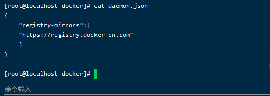
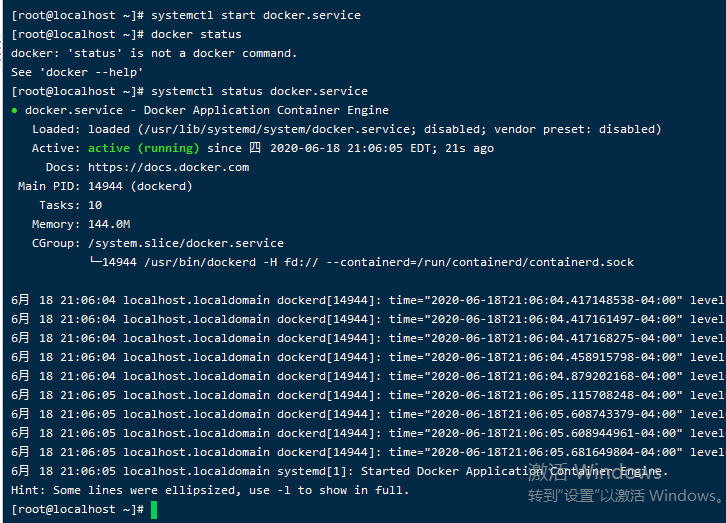
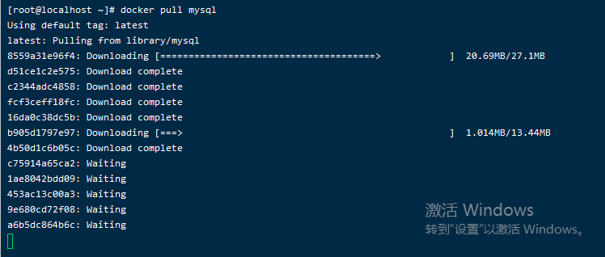
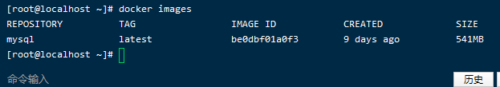
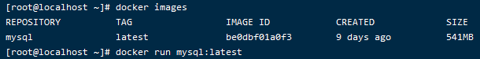
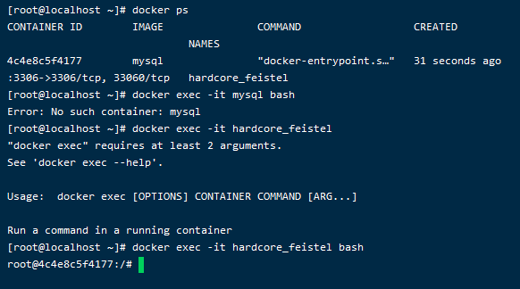
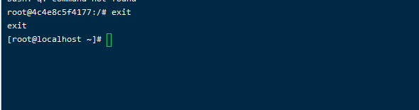
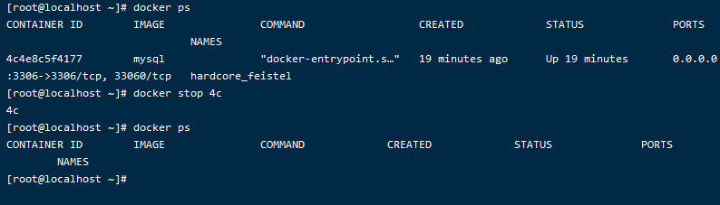
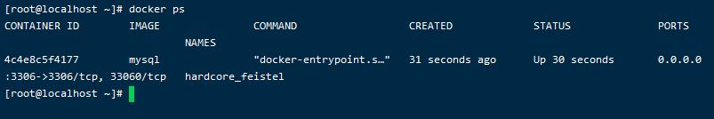

# 什么Docker
Docker是一款基于Go语言实现的、开源的应用容器引擎

# Docker有什么用
- 开发者可以将应用程序及其相关的依赖部署到这个可移植的应用容器中，然后发布到Linux服务器上面
- 能够自动化打包web应用程序

# Docker的特点
使用docker能够快速的交付代码，测试和部署代码
# Docker与虚拟机两者之间的区别

# Docker安装
## 1.CentOS上安装
### 1.1 yum安装，安装Engine-Community
#### 1.1.1 安装所需的软件包，yum-utils提供了yum-config-manager，device-mapper-persistent-data和lvm2
```shell script
yum install -y yum-utils device-mapper-persistent-data lvm2
```
### 1.2 设置yum仓库地址
```shell script
yum-config-manager --add-repo http://mirrors.aliyun.com/docker-ce/linux/centos/docker-ce.repo
```
### 1.3 安装社区版docker-engine
```shell script
yum install docker-ce docker-ce-cli containerd.io
```
## 2.测试一下docker是否已经安装成功
```shell script
docker -v
```
如果显示docker的版本号，那么安装就成功了


## 3.从仓库拉取镜像
### 3.1 修改配置文件，配置仓库地址，配置成国内的源
```shell script
vim /etc/docker/daemon.json
#重启一下服务
systemctl start docker.service
#查看当前docker的运行状态
systemctl status docker.service
```



### 3.2 从公开仓库拉取命令
````shell script
docker pull morrorsname:tag
````
例如，拉取MySQL镜像，写版本号，默认拉取最新的版本
```shell script
docker pull mysql
```


# 常用的Docker命令
## 1.本地镜像管理
### 1.1 images 查看本地的镜像
```shell script
docker images
```


### 1.2 rmi 删除镜像
```shell script
docker rmi name:tag 
```

## 2. 容器生命周期管理
### 2.1 rm 删除镜像
```shell script
docker image rm name:tag
```
### 2.2 run 启动镜像
```shell script
docker run name:tag
```


### 2.3 exec 进入容器
#### 2.3.1 有时候容器实在后台进行运行的，需要进入容器的时候就要执行下面的命令了
```shell script
docker exec -it containername bash
```
#### 2.3.2 进入Mysql容器
```shell script
docker exec -it hardcore_feistel bash
```

#### 2.3.3 当需要时，我们可以退出容器
```shell script
exit
```

### 2.4 stop 停掉一个容器
```shell script
docker stop containerId
#或者是
docker stop name
```
#### 2.4.1 停掉Mysql容器，使用id可以略写
```shell script
docker stop 4c
```

## 3.容器操作
### 3.1 ps 查看容器的状态
```shell script
docker ps
```


## 4. 镜像仓库
### 4.1 pull 拉取镜像
```shell script
docker pull name:tag
```

### 4.2 push 上传镜像

# 常用参数
## 1. 指定宿主机和端口映射口 -p
## 2. 指定启动容器名字      --name
## 3. 指定后台执行          -d
## 4. 直接使用宿主机网络    --net=host
## 5. 自动将当前容器连接到对方网络，使用容器名而不用IP地址  --link 其他容器名
## 6. 指定宿主机文件挂载到容器文件位置  -v
## 7. docker服务重启后，容器自动启动   --restart=always


# 制作编译镜像并上传镜像 

## 1. 下面一个dockerfile文件

```dockerfile
FROM python:3.6-alpine

ENV WORK_DIR=/root

WORKDIR $WORK_DIR

ADD . .

RUN ls>a.txt

CMD ["/bin/sh","-c","while true; do sleep 1000; done"]
```
### 1.1 指令解析
#### 1.1.1 FROM 指定基础镜像
     
  指定一个python3.6的基础镜像，往后的指令需要从这个基础镜像进行开始执行

#### 1.1.2 ENV  

#### 1.1.3 WORKDIR

#### 1.1.4 ADD

#### 1.1.5 RUN 往控制台发送命令

#### 1.1.6 ENTRYPOINT/CMD 容器启动执行
#### 1.1.7 COPY/OR 宿主机系统拷贝文件到镜像中
#### 1.1.8 VOLUME 创建数据卷，这里指定了不需要再run指定-v了
#### 1.1.9 EXPOSE 可以为镜像指定要暴露的端口

## 2. 构建镜像
```shell script
docker build -t nginx:latest -f ./nginx/Dockerfile
```
## 3. 上传镜像
```shell script
docker tag hello-world:1.0 115.29.215.82:8000/spider/hello-world:1.0
docker push 115.29.215.82:8000/spider/hello-world:1.0
```


