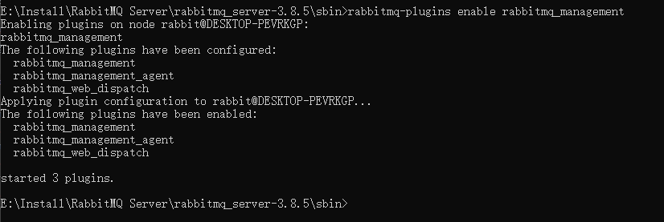
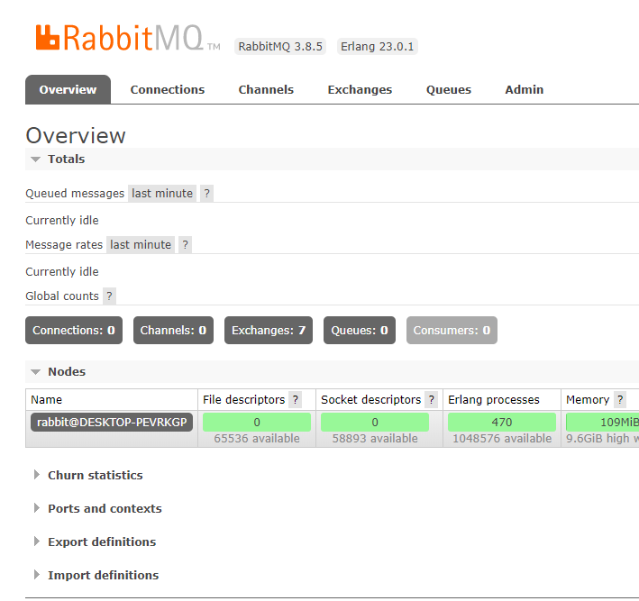
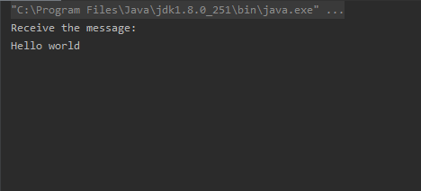

# RabbitMQ
 是一个消息代理，支持多种异步处理消息的方式，比较常见的两种方式
 
 - work queues:将消息缓存到队列里面，默认情况下，多个worker会根据round robin分配获取消息，每个消息只能有一个worker
 - publish/subscribe：每个订阅消息的消费者都能接受到信息，每个worker会做出不同的处理
# 使用RabbitMQ的优点
使用消息队列，我们可以将那些不是很紧急，而且比较占计算资源的任务以消息的方式存储到队列里面，然后使用多个模块进行处理

- **提高系统峰值处理能力**，对系统来不及处理的消息缓存到队列里面，减小系统的负荷，然后再慢慢的处理消息队列的任务。
- **解耦**，对于生产者来说，我把消息推进队列里面，队列里面的消息什么时候处理完，不会影响生产者运作。

# RabbitMQ环境安装
下载安装Erlang [Erlang下载地址](http://www.erlang.org/download)

下载安装RabbitMQ Server[RabbitMQ下载地址](http://www.rabbitmq.com/download.html)

# 运行RabbitMQ
## 1.切换到RabbitMQ安装目录下面并启动监控管理器，如图所示

## 2.在浏览器访问localhost:15672，默认账号和密码是guest


# Java使用RabbitMQ
## 1.简单队列

### 1.1导入相关的jar包

- amqp-client-4.0.0.jar包 [下载地址](https://repo1.maven.org/maven2/com/rabbitmq/amqp-client/4.0.0/amqp-client-4.0.0.jar)
- log4j-1.2.17.jar包 [下载地址](https://repo1.maven.org/maven2/log4j/log4j/1.2.17/log4j-1.2.17.jar)

### 1.2编写生产者
```java
package com.jin10;

import com.rabbitmq.client.AMQP;
import com.rabbitmq.client.Channel;
import com.rabbitmq.client.Connection;
import com.rabbitmq.client.ConnectionFactory;

import java.io.IOException;
import java.util.concurrent.TimeoutException;

public class Producer {

    private final static String QueueName = "HelloRabbitMQ";

    public void publish() throws IOException, TimeoutException {

        /**
         * 创建一个连接，连接到RabbitMQ
         */
        ConnectionFactory connectionFactory = new ConnectionFactory();

        /**
         * 并Rabbit MQ所在主机地址和端口号
         */
        connectionFactory.setHost("localhost");
        //connectionFactory.setPort(15672);

        /**
         * 新建一个连接
         */
        Connection connection = connectionFactory.newConnection();

        /**
         * 创建一个通道
         */
        Channel channel = connection.createChannel();

        /**
         * 声明一个队列
         */
        AMQP.Queue.DeclareOk declareOk = channel.queueDeclare(QueueName, false, false, false, null);

        /**
         * 定义要发送的信息
         */
        String message = "Hello world";

        /**
         * 往队列里面缓存信息
         */
        channel.basicPublish("",QueueName,null,message.getBytes());

    }

}

```

### 1.3编写消费者
```java
package com.jin10;

import com.rabbitmq.client.*;

import java.io.IOException;
import java.util.concurrent.TimeoutException;

public class Consumer {

    private final static String QueueName = "HelloRabbitMQ";

    public void Receive() throws IOException, TimeoutException {

        ConnectionFactory connectionFactory = new ConnectionFactory();

        connectionFactory.setHost("localhost");

        Connection connection = connectionFactory.newConnection();
        Channel channel = connection.createChannel();
        channel.queueDeclare(QueueName,false,false,false,null);

        DefaultConsumer consumer = new DefaultConsumer(channel){
            @Override
            public void handleDelivery(String consumerTag, Envelope envelope, AMQP.BasicProperties properties, byte[] body) throws IOException {
                super.handleDelivery(consumerTag, envelope, properties, body);
                String s = new String(body, "utf-8");
                System.out.println("Receive the message:\n" + s);
            }
        };

        /**
         * 执行回调函数consumer
         */
        channel.basicConsume(QueueName,true, consumer);
        channel.close();
        connection.close();
    }
}
```
### 1.4主程序Main
```java
package com.jin10;

import java.io.IOException;
import java.util.concurrent.TimeoutException;

public class Main {

    public static void main(String[] args) throws IOException, TimeoutException {
	// write your code here
        Producer producer = new Producer();
        Consumer consumer = new Consumer();

        producer.publish();
        consumer.Receive();
    }
}
```
### 1.5 运行结果


## 2.WorkQueues队列
### 2.1

# SpringBoot使用RabbitMQ


# RabbitMQ常用命令
## 1.启动RabbitMQ  
    net start RabbitMQ
## 2.关闭RabbitMQ
    net stop RabbitMQ
## 3.启动监控管理器
    rabbitmq-plugins enable rabbitmq_management
## 4.关闭监控管理器
    rabbitmq-plugins disable rabbitmq_management
## 5.查看所有队列
    rabbitmqctl list_queues
## 6.清除所有队列
    rabbitmqctl rset