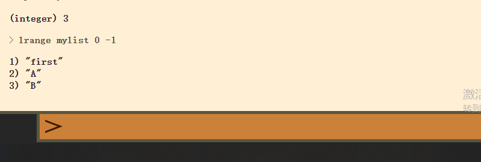
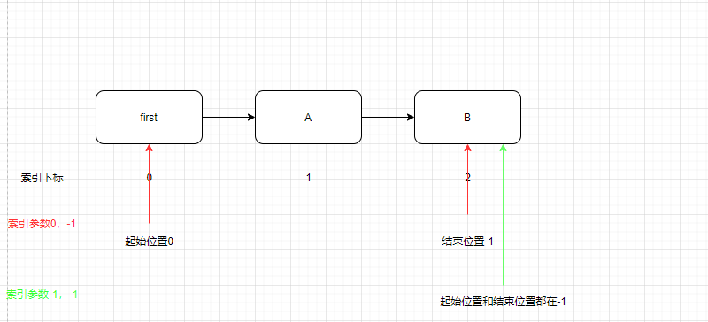

# 1.认识Redis

什么是Redis？Redis也叫远程字典服务，它本身是用C语言进行编写的一款支持网络、基于内存亦可持久化的日志型的和支持多种语言API的key-value型数据库。简言之就是Redis是一款高性能的Key-Value的数据库。它的高性能主要体现在它基于内存进行操作的，在对数据进行读写方面的速度都是非常快的。

# 2.Redis的自身特点

- 支持每秒十几万的读写操作

- 支持集群

- 支持分布式

- 主从同步

- 支持一定的事务能力

  

  

# 3.Redis的应用场景

结合上述讲到的特点，它的应用场景如下：

- Redis可以存储缓存数据;
- 高速读写数据的场景。

## a.存储缓存数据

相对于使用传统的数据库，在用户请求进行读写数据库中的数据时候，数据库会根据相应的SQL语句然后进行磁盘进行查找索引，然后返回数据。这个过程是比较低效的，在请求数量增多的时候，数据库的连接数一定时，整个系统的处理速度就会出现缓慢，甚至宕机。对于这种情况下，Redis的处理流程是，在第一次请求访问数据资源的时候，读取Redis就是失败，因为内存还没有加载任何数据，这时候Redis就会去访问数据库，将数据加载到内存中，然后返回给用户。当下一个请求访问同样的数据的时候，Redis就会直接从内存中提取缓存数据进行返回，因为实在内存中，读取访问速度非常快。如此一来减少了直接对数据库的访问，也大大提高了处理速度。

## b.高速读写应用场景，秒杀，抢购等

# 4.Redis的数据类型

既然它作为一款数据库软件，那它的所能够存储的数据类型有哪些？Redis并不是简单的key-value存储，实际上他是一个数据结构服务器，支持不同类型的值。也就是说，你不必仅仅把字符串当作键所指向的值。下列这些数据类型都可作为值类型：

- 二进制安全的字符串

- Lists: 按插入顺序排序的字符串元素的集合。他们基本上就是*链表（linked lists）*。

- Sets: 不重复且无序的字符串元素的集合。

- Sorted sets,类似Sets,但是每个字符串元素都关联到一个叫*score*浮动数值（floating number value）。里面的元素总是通过score进行着排序，所以不同的是，它是可以检索的一系列元素。（例如你可能会问：给我前面10个或者后面10个元素）。

- Hashes,由field和关联的value组成的map。field和value都是字符串的。这和Ruby、Python的hashes很像。

- Bit arrays (或者说 simply bitmaps): 通过特殊的命令，你可以将 String 值当作一系列 bits 处理：可以设置和清除单独的 bits，数出所有设为 1 的 bits 的数量，找到最前的被设为 1 或 0 的 bit，等等。

- HyperLogLogs: 这是被用于估计一个 set 中元素数量的概率性的数据结构。别害怕，它比看起来的样子要简单…参见本教程的 HyperLogLog 部分

  

- Redis的String 类型

  

- Redis的List 类型

  强调说明，Redis中List类型是基于Linked List进行实现的，在添加和删除元素中的时候，无论是列表的数据量多长，时间复杂度都是一样的，常量级别
  
  首先在链表的右边添加两个元素A和B，然后再在链表的左边添加First元素
  
  
  其次从Lrange取出指定范围的元素
  
  lrange的下标索引为开始0位置到最后一个元素的位置，-1对应链表中最后一个元素，-2代表链表中倒数第二个元素，以此类推。对于lrange命令中索引的参数理解
  示例：
  就刚才的Key-Value数据，操作执行命令如下
  
  
  
  综上总结：对于Redis的Lrange的提取数据操作，实现过程
  
  
  pop,它从list中删除元素并同时返回删除的值。可以在左边或右边操作
  
  
  使用LTRIM把list从左边截取指定长度
  
  **使用场景**

  正如你可以从上面的例子中猜到的，list可被用来实现聊天系统。还可以作为不同进程间传递消息的队列。关键是，你可以每次都以原先添加的顺序访问数据。这不需要任何SQL ORDER BY 操作，将会非常快，也会很容易扩展到百万级别元素的规模。

  例如在评级系统中，比如社会化新闻网站 reddit.com，你可以把每个新提交的链接添加到一个list，用LRANGE可简单的对结果分页。

  在博客引擎实现中，你可为每篇日志设置一个list，在该list中推入博客评论，等等。

- Set 类型

- Sort Set 类型（有序Set集合）

- Hash 类型

# 5.Redis复制
上面有提到，Redis支持主从复制，基于Redis的基础上，要配置Redis的主从复制是非常方便的。主从复制就是从服务器（slave）精确地复制主服务器（master）的数据。
# 6.Redis事务
MULTI 、 EXEC 、 DISCARD 和 WATCH 是 Redis 事务相关的命令。事务可以一次执行多个命令。
## Redis事务有两个重要的保证指标：
- 事务是一个单独的隔离操作：事务中的所有命令都会序列化、按顺序地执行。而且执行的过程中，不会被其他客户端发送来的命令请求所打断。
- 事务是一个原子操作：事务中的命令要么全部被执行，要么全部都不执行。
## EXEC命令
作用：触发并执行所事务的命令
## MULTI命令
作用：开启一个事务，向服务器端发送一系列命令，但并不会马上执行，会在队列里面等待着，直至执行EXEC命令
## DISCARD命令
作用：清空排列在队列里面的事务，并放弃执行事务，客户端会从事务的状态退出来
## WATCH命令
作用：WATCH 使得 EXEC 命令需要有条件地执行： 事务只能在所有被监视键都没有被修改的前提下执行， 如果这个前提不能满足的话，事务就不会被执行。它可以被多次调用，直至到
EXEC命令执行完。
#7.Redis持久化方式
- RDB持久化方式
在指定时间间隔内进行快照存储
- AOF持久化方式
记录对服务器写的操作，AOF命令会以Redis协议追加到每次写操作文件的结尾，当服务器重启的时候执行这些命令进行恢复原始数据。

# 8.Java使用Redis
首先下载Redis的jar包 [Jedis](https://repo1.maven.org/maven2/redis/clients/jedis/3.2.0/jedis-3.2.0.jar)
将包导入到项目工程中（右键工程——>Open Module Setting——>将Jar包添加进来）

# 9.Spring使用Redis

# 10.Springboot使用Redis
