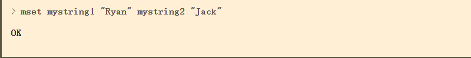

# 1.认识Redis

什么是Redis？Redis也叫远程字典服务，它本身是用C语言进行编写的一款支持网络、基于内存亦可持久化的日志型的、支持多种语言API的、存储类型是key-value的**非关系型数据库**。简言之就是Redis是一款高性能的Key-Value的数据库。它的高性能主要体现在它基于内存进行操作的，在对数据进行读写方面的速度都是非常快的。

上面提到什么是非关系型数据库？非关系型数据库也叫NoSQL（全称Not only SQL），是相对于传统的关系型数据库的统称。传统的软件系统的大体的架构是用户——DAL——数据库系统

而对于并发量大的场景，这种架构是无法承受这么大的访问量，于是在此架构上进一步的进行改动，用户——DAL——缓存——数据库系统

尽管如此，有时候会遇见某个sql 语句需要锁表，导致暂时不能使用读的服务，这样就会影响现有业务，使用主从复制，让主库负责写，从库负责读，这样，即使主库出现了锁表的情景，通过读从库也可以保证业务的正常运作。

而Redis里面也是使用到主从复制的

###关系型数据库

1.特点
  - 严格的一致性
  - 事务支持使得安全性更高
  - 数据和关系都存储在表中
   
2.缺点
  - 大量数据的处理
  - 扩展性差，字段增加不便利
###非关系型数据库
1.优点
   - 存储结构是基于Key-value的对应关系，处理速度快

2.缺点
   - 有限的查询方式


# 2.Redis的自身特点

- 支持每秒十几万的读写操作

- 支持集群

- 支持分布式

- 主从同步

- 支持一定的事务能力

# 3.Redis的应用场景

结合上述讲到的特点，它的应用场景如下：

- Redis可以存储缓存数据;
- 高速读写数据的场景。

## a.存储缓存数据

相对于使用传统的数据库，在用户请求进行读写数据库中的数据时候，数据库会根据相应的SQL语句然后进行磁盘进行查找索引，然后返回数据。这个过程是比较低效的，在请求数量增多的时候，数据库的连接数一定时，整个系统的处理速度就会出现缓慢，甚至宕机。对于这种情况下，Redis的处理流程是，在第一次请求访问数据资源的时候，读取Redis就是失败，因为内存还没有加载任何数据，这时候Redis就会去访问数据库，将数据加载到内存中，然后返回给用户。当下一个请求访问同样的数据的时候，Redis就会直接从内存中提取缓存数据进行返回，因为实在内存中，读取访问速度非常快。如此一来减少了直接对数据库的访问，也大大提高了处理速度。

## b.高速读写应用场景，秒杀，抢购等


# 4.Redis的数据类型

既然它作为一款数据库软件，那它的所能够存储的数据类型有哪些？Redis并不是简单的key-value存储，实际上他是一个数据结构服务器，支持不同类型的值。也就是说，你不必仅仅把字符串当作键所指向的值。下列这些数据类型都可作为值类型：

- 二进制安全的字符串

- Lists: 按插入顺序排序的字符串元素的集合。他们基本上就是*链表（linked lists）*。

- Sets: 不重复且无序的字符串元素的集合。

- Sorted sets,类似Sets,但是每个字符串元素都关联到一个叫*score*浮动数值（floating number value）。里面的元素总是通过score进行着排序，所以不同的是，它是可以检索的一系列元素。（例如你可能会问：给我前面10个或者后面10个元素）。

- Hashes,由field和关联的value组成的map。field和value都是字符串的。这和Ruby、Python的hashes很像。

- Bit arrays (或者说 simply bitmaps): 通过特殊的命令，你可以将 String 值当作一系列 bits 处理：可以设置和清除单独的 bits，数出所有设为 1 的 bits 的数量，找到最前的被设为 1 或 0 的 bit，等等。

- HyperLogLogs: 这是被用于估计一个 set 中元素数量的概率性的数据结构。别害怕，它比看起来的样子要简单…参见本教程的 HyperLogLog 部分

[在线Redis命令窗口](http://try.redis.io/) 

- Redis的String 类型

  设置元素
  
  语法格式 set key value
  
  语法格式 mset key value1 value2 ...
    
  执行结果
  
  
  
  

  添加元素
  
  语法格式 append key value (追加一个元素)
  
  执行结果
  
  
  
  
  获取元素
  
  语法格式 get key value
  
  语法格式 mget key value
  
  执行结果
  
  
  
  
  
  

- Redis的List 类型

  强调说明，Redis中List类型是基于Linked List进行实现的，在添加和删除元素中的时候，无论是列表的数据量多长，时间复杂度都是一样的，常量级别
  
  首先在链表的右边添加两个元素A和B，然后再在链表的左边添加First元素
  
  
  
  其次从Lrange取出指定范围的元素
  
  
  
  lrange的下标索引为开始0位置到最后一个元素的位置，-1对应链表中最后一个元素，-2代表链表中倒数第二个元素，以此类推。对于lrange命令中索引的参数理解
  示例：
  就刚才的Key-Value数据，操作执行命令如下
  
  
  
  
  
  综上总结：对于Redis的Lrange的提取数据操作，实现过程
  
  
  
  pop,它从list中删除元素并同时返回删除的值。可以在左边或右边操作
  
  
  使用LTRIM把list从左边截取指定长度
  
  
  
  
  
  [List命令详情](http://www.redis.cn/commands.html#list)
  
  **使用场景**

  list可被用来实现聊天系统。还可以作为不同进程间传递消息的队列。关键是，你可以每次都以原先添加的顺序访问数据。这不需要任何SQL ORDER BY 操作，将会非常快，也会很容易扩展到百万级别元素的规模。

  例如在评级系统中，比如社会化新闻网站 reddit.com，你可以把每个新提交的链接添加到一个list，用LRANGE可简单的对结果分页。

  在博客引擎实现中，你可为每篇日志设置一个list，在该list中推入博客评论，等等。

- Set 类型

    Redis Set类型是无序排列，常见的操作指令如下：
    
    添加元素
    - 语法格式：sadd key value1 value2 ...
    
        执行结果如图所示
        
        
        
    是否包含指定元素
     
    - 语法格式：sismember key member(value)
        
         执行结果如图显示
         
         
         
     随机删除一个元素， 返回给客户端
     
     - 语法格式：spop key 
     
         执行结果
         
     查看一个名为key的set中所有元素
     
     - 语法格式：smembers key
     
         执行结果
         
        
     集合中元素的数量
     
     - 语法格式：scard key
     
         执行结果
         
           
          [Set命令详情](redis.cn/commands.html#set)
    

- Sort Set 类型（有序Set集合）

     添加元素
     
     - 语法格式： zadd key score1 value1 score2 value2 ...
     
        执行结果
        
        
     查询所有结果
     
     - 语法格式： zrange key start end
     
        执行结果
        
        
     从最小到最大查询所有结果
     
     - 语法格式：zrevrange key start end
     
        执行结果
       
     返回指定范围内的成员数
     
     - 语法格式：zlexcount key min max
     
        执行结果
        
        
     返回有序集合中指定分数间的元素，按小到大进行排列
     
     - 语法格式：zrangebyscore key min max 
     
        执行结果
        
        
        [SortSet命令详情](http://www.redis.cn/commands.html#sorted_set)
        
- Hash 类型

    设置元素
    
    语法格式：hset key filed value
    
    执行结果
    
    
    语法格式：hmset key filed1 value1 filed2 value2 ..
    
    执行结果
    
    
    获取元素
    
    语法格式：hget key filed
    
    执行结果
    
    
    语法格式：hmget key filed1 filed2...
    
    执行结果
    
     
    语法格式：hgetall key
    
    执行结果
    
     
    删除元素
    
    语法格式：hdel key filed1 filed2..
    
    执行结果
    
    
    [hash具体的命令使用](http://www.redis.cn/commands.html#hash)
    
    
    

# 5.Redis复制
上面有提到，Redis支持主从复制，基于Redis的基础上，要配置Redis的主从复制是非常方便的。主从复制就是从服务器（slave）精确地复制主服务器（master）的数据。
# 6.Redis事务
MULTI 、 EXEC 、 DISCARD 和 WATCH 是 Redis 事务相关的命令。事务可以一次执行多个命令。
## Redis事务有两个重要的保证指标：
- 事务是一个单独的隔离操作：事务中的所有命令都会序列化、按顺序地执行。而且执行的过程中，不会被其他客户端发送来的命令请求所打断。
- 事务是一个原子操作：事务中的命令要么全部被执行，要么全部都不执行。
## EXEC命令

作用：触发并执行所事务的命令

## MULTI命令

作用：开启一个事务，向服务器端发送一系列命令，但并不会马上执行，会在队列里面等待着，直至执行EXEC命令

## DISCARD命令

作用：清空排列在队列里面的事务，并放弃执行事务，客户端会从事务的状态退出来

## WATCH命令

作用：WATCH 使得 EXEC 命令需要有条件地执行： 事务只能在所有被监视键都没有被修改的前提下执行， 如果这个前提不能满足的话，事务就不会被执行。它可以被多次调用，直至到
EXEC命令执行完。

#7.Redis持久化方式

- RDB持久化方式。
在指定时间间隔内进行快照存储。
- AOF持久化方式。
记录对服务器写的操作，AOF命令会以Redis协议追加到每次写操作文件的结尾，当服务器重启的时候执行这些命令进行恢复原始数据。

# 8.Java使用Redis

##首先下载Redis的jar包 [Jedis](https://repo1.maven.org/maven2/redis/clients/jedis/3.2.0/jedis-3.2.0.jar)

##其次，将包导入到项目工程中（右键工程——>Open Module Setting——>将Jar包添加进来）

##1.连接Redis数据库

```java
        Jedis jedis = new Jedis("127.0.0.1",6379);
        //测试是否Redis服务器已经打开，没有开启会出现异常
        String s = "ping";
        System.out.println(jedis.ping(s));
```

##2.首先操作String类型

```java
        String set = jedis.set("mykey", "Redis");
        System.out.println(set);   //返回设置状态码OK
        System.out.println(jedis.get("mykey"));//等同于Redis的get(key)命令，结果返回为Redis
```
   ##执行的结果显示


##3.List类型

```java
                //lists类型
                //链表尾部添加元素
                System.out.println("链表尾部添加元素" + jedis.rpush("mylist","1","2","3","10"));
        
                //将下标为1的元素设置成gg
                System.err.println("执行设置指定下标的值状态：" + jedis.lset("mylist",1,"gg"));
                System.out.println("将下标为1的元素设置成gg" + jedis.lrange("mylist",0,-1));
        
                //取出指定下标的元素
                System.out.println("取出指定下标3的元素" + jedis.lindex("mylist",3));
        
                //取出所有元素
                System.out.println("链表中元素为：" + jedis.lrange("mylist",0,-1));
        
                //截取指定范围内的元素
                System.out.println("截取指定范围内的元素操作返回状态：" + jedis.ltrim("mylist",0,2));
                System.out.println("截取指定范围内(0-2)的元素" + jedis.lrange("mylist",0,-1));
        
                //mylist对应的长度
                System.err.println("mylist对应的长度为：" + jedis.llen("mylist"));
        
                //删除mylist对应的所有值
                System.err.println("删除mylist对应的所有值" + jedis.del("mylist"));
                System.out.println("全部删除mylist后对应的所有值" + jedis.lrange("mylist",0,-1));
```

##最终的执行结果为，如图所示


##4.Set类型

```java
        //set类型
        System.out.println("myset进行添加元素的操作状态：" + jedis.sadd("myset","iphone","huawei","leshi","xiaomi"));
        System.out.println("myset中所有的元素：" + jedis.smembers("myset"));
        System.out.println("myset1进行添加元素的操作状态：" + jedis.sadd("myset1","1","2","3","ben"));
        System.out.println("myset2进行添加元素的操作状态：" + jedis.sadd("myset2","4","10","3","ben"));
        System.out.println("随机返回key名称为myset中set的一个元素：" + jedis.srandmember("myset"));
        System.out.println("删除名称为myset的set中的名为xiaomi元素：" + jedis.srem("myset","xiaomi"));
        System.out.println("返回myset中所有的元素：" + jedis.smembers("myset"));
        System.out.println("随机删除名称为myset的set元素：" + jedis.spop("myset"));
        System.out.println("返回名称为myset的set的基数：" + jedis.scard("myset"));
        System.out.println("iphone是否是myset中的元素：" + jedis.sismember("myset","iphone"));
        System.out.println("求myset1和myset2的交集：" + jedis.sinter("myset1","myset2"));

        String[] detkey = new String[0];
        System.out.println("将myset1和myset2所求的交集放到detkey数组中："+ jedis.sinterstore(String.valueOf(detkey),"myset1","myset2"));
        System.out.println("求myset1和myset2的并集：" + jedis.sunion("myset1","myset2"));
        System.out.println("返回myset1中所有的元素：" + jedis.smembers("myset1"));
```

##执行结果如图所示


##5.Hash类型

```java
        //Hash类型
        Map<String,String> map = new HashMap<>();
        map.put("a","AA");
        map.put("b","BB");
        map.put("c","CC");
        map.put("d","DD");

        System.out.println("往myhash添加元素：" + jedis.hset("myhash","f","FF"));
        System.out.println("返回myhash中f对应的元素：" + jedis.hget("myhash","f"));
        System.out.println("往myhash添加元素:" + jedis.hmset("myhash",map));
        System.out.println("返回myhash中的元素的个数" + jedis.hlen("myhash"));
        System.out.println("返回myhash中所有的key的个数：" + jedis.hkeys("myhash"));
        System.out.println("返回名称为key的hash中所有的键（field）及其对应的value：" + jedis.hgetAll("myhash"));
        System.out.println("返回myhash中的值：" + jedis.hvals("myhash"));
        System.out.println("返回myhash中对应的元素：" + jedis.hgetAll("myhash"));
        System.out.println("myhash中是否存在a对应的域值：" + jedis.hexists("myhash","a"));
        System.out.println("删除myhash中a对应的域值：" + jedis.del("myhash","a"));
        System.out.println("返回名称为key的hash中所有的键（field）及其对应的value：" + jedis.hgetAll("myhash"));

```

##执行结果，如图


##6.SortList类型

```java
        //sortList类型
        System.out.println(jedis.zadd("mysortlist1",1,"car"));
        System.out.println(jedis.zadd("mysortlist1",2,"dog"));
        System.out.println(jedis.zadd("mysortlist1",0,"music"));
        System.out.println("逐个成员添加方式，mysortlist1列表中的元素：" + jedis.zrange("mysortlist1",0,-1));

        Map<String,Double> sortListMap = new HashMap<>();
        sortListMap.put("car", Double.valueOf(1));
        sortListMap.put("dog", Double.valueOf(2));
        sortListMap.put("music", Double.valueOf(0));
        System.out.println(jedis.zadd("mysortlist2",sortListMap));
        System.out.println("以Map添加方式，mysortlist2列表中的元素：" + jedis.zrange("mysortlist2",0,-1));

        System.out.println("返回mysortlist2中的个数：" + jedis.zcard("mysortlist2"));
        System.out.println("删除并返回mysortlist1中的最大的：" + jedis.zpopmax("mysortlist1"));
        System.out.println("删除并返回mysortlist2中的最大的：" + jedis.zpopmax("mysortlist2"));
        System.out.println("返回mysortlist1中dog成员的score值：" + jedis.zscore("mysortlist1","dog"));
        System.out.println("计算mysortlist1在0-1score值分区中的成员数量为：" + jedis.zcount("mysortlist1" ,0,1));
        Set<String> zr = jedis.zrange("mysortlist1", 0, 1);
        System.out.println("返回在0-1范围内的成员Set集合：" );
        Iterator<String> zriterator = zr.iterator();
        while (zriterator.hasNext()){
            System.out.println(zriterator.next());
        }
```

##执行结果，如图所示


# 9.Spring使用Redis

# 10.Springboot使用Redis

##首先创建工程，然后需要在config配置文件中进行配置，如图所示


主要进行远程访问地址、端口号和密码的配置
##1.String类型

```java
        //String类型
        redisTemplate.opsForValue().set("k","v");
        System.err.println("k对应的值是：" + redisTemplate.opsForValue().get("k"));
        redisTemplate.opsForValue().append("k","g");
        System.err.println("k对应的值是：" + redisTemplate.opsForValue().get("k"));
        String s1 = redisTemplate.opsForValue().get("k", 0, 0);
        System.err.println("结果显示为：" + s1);
        String s2 = redisTemplate.opsForValue().get("k", 0, -1);
        System.err.println("结果显示为：" + s2);
```
##执行结果


##2.hash类型

```java
        //Hash类型
        redisTemplate.opsForHash().put("hash","mm","mysql");
        redisTemplate.opsForHash().put("hash","gg","sqlserver");
        System.err.println("redis对应的值是：" + redisTemplate.opsForHash().get("hash","mm"));
        System.err.println("gg对应的值是：" + redisTemplate.opsForHash().get("hash","gg"));

        System.out.println("mm这个可以是否存在" + redisTemplate.opsForHash().hasKey("hash","mm"));

        redisTemplate.opsForHash().delete("hash","mm","gg");
        System.out.println("gg这个可以是否存在" + redisTemplate.opsForHash().hasKey("hash","gg"));
        System.err.println("删除后的结果为：" + redisTemplate.opsForHash().get("hash","mm") + redisTemplate.opsForHash().get("hash","gg"));

```

##运行结果


##3.Set类型

```java
        redisTemplate.opsForSet().add("c1","ben","king");
        redisTemplate.opsForSet().add("c2","Linux","Java","king");
        Collection<String> c = new LinkedList<>();
        c.add("c1");
        c.add("c2");

        System.err.println("判断car2中是否有元素ben:" + redisTemplate.opsForSet().isMember("c2","king"));
        Set<String> difference = redisTemplate.opsForSet().difference("c1", "c2");
        Set<String> set = redisTemplate.opsForSet().difference("c1", c);

        System.err.println("set和difference是否相同：" + set.equals(difference));
        System.err.println("c1和c2相比，不同的元素有" + difference.size() + "分别是：");
        Iterator<String> iterator = difference.iterator();
        while (iterator.hasNext()){
            System.out.println(iterator.next());
        }

        System.err.println("-------分割线-------------------");
        System.err.println("从c1取出两个数据，分别是：" + redisTemplate.opsForSet().pop("c1",2));
        System.err.println("c1对应的值：" + redisTemplate.opsForSet().pop("c1"));
        System.err.println("c2对应的值：" + redisTemplate.opsForSet().pop("c2"));
```

##执行结果


##4.List类型

```java
        //List类型
        redisTemplate.opsForList().rightPush("name1","Ryan");
        redisTemplate.opsForList().rightPush("name2","Jack");
        redisTemplate.opsForList().rightPush("name3","Jane");
        redisTemplate.opsForList().rightPushAll("name4","Ryan","Jack","Jane");

        System.err.println("name1对应的值为：" + redisTemplate.opsForList().leftPop("name1"));
        System.err.println("name2对应的值为：" + redisTemplate.opsForList().leftPop("name2"));
        System.err.println("name3对应的值为：" + redisTemplate.opsForList().leftPop("name3"));
        System.err.println("name4对应的值为：" + redisTemplate.opsForList().size("name4"));
        System.err.println(redisTemplate.opsForList().range("name4",0,-1));
        System.err.println("name4中下标2的元素是:" + redisTemplate.opsForList().index("name4",2));
```

##执行结果


##5.SortSet类型

```java
        ZSetOperations<String, String> ZSetOperations = redisTemplate.opsForZSet();
        //增加操作，方式一
        ZSetOperations.add("myzset","AA",0);
        ZSetOperations.add("myzset","BB",10);
        ZSetOperations.add("myzset","CC",5);

        //增加操作，方式二
        ZSetOperations.TypedTuple<String> tuple = new DefaultTypedTuple<>("N", (double) 2);
        ZSetOperations.TypedTuple<String> tuple1 = new DefaultTypedTuple<>("b",(double) 3);
        ZSetOperations.TypedTuple<String> tuple2 = new DefaultTypedTuple<>("a",(double) 4);
        Set<ZSetOperations.TypedTuple<String>> sz = new HashSet<>();
        sz.add(tuple);
        sz.add(tuple1);
        sz.add(tuple2);
        Long myzsetLong = ZSetOperations.add("myzset", sz);
        System.err.println("myzset的长度为：" + myzsetLong);

        //查询取出数据
        System.err.println("myzset对应的值为：" + ZSetOperations.range("myzset",0,-1));
//        ZSetOperations.removeRange("myzset",0,-1);
        ZSetOperations.remove("myzset","AA","N");
        System.err.println("remove操作后，剩余元素为：" + ZSetOperations.range("myzset",0,-1));
        ZSetOperations.removeRange("myzset",0,-1);
```
##执行结果


